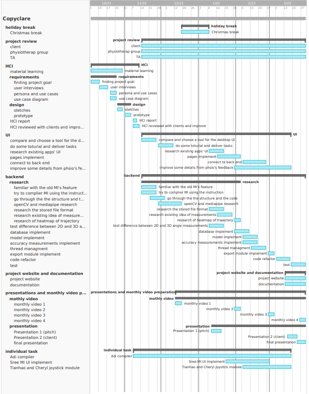

Welcome to Copyclare
====================

.. toctree::
   :hidden:
   :caption: CopyClare

   requirements
   research
   algorithms
   ui-design
   system-design
   implementation
   testing
   evaluation
   documentation
   appendices

Your personal physiotherapy assistant.

Abstract
--------
* Problem statement

In the global epidemic environment, it is not convenient to make an appointment with a physiotherapy for offline consultation. And for a long time, physiotherapists have only been able to understand the rehab of patients through words, which lacks sufficient evidence to support it. Also when patients are trying to do rehab alone, they also face problems such as lack of feedback to improve movements and lack of motivation to track progress.

* Our solution

	* Use Computer Vision to detect the important joints while doing exercises
	* evaluate the motion by the model
	* take down all performance data
	* generate exportable report

* Achievement and impact

CopyClare is an exercise video analysis tool that provides real-time accuracy feedback as patients are doing their rehabilitation exercises. The easy-to-use native Windows app provides a side-by-side view for users to compare their postures with the exercise video. Not only will CopyClare motivate patients as they see their progress over time, it can also provide physiotherapists with their patient’s long term performance data. Since our tool creates rehab assessment forms as well, So in essence, we are digitalising physiotherapy.

The demo video
--------------

The development team
--------------------
* Adi Bozzhanov (adi.bozzhanov.20@ucl.ac.uk)

* Yan Lai (yan.lai.20@ucl.ac.uk)

* Sree Sanakkayala (sree.sanakkayala.20@ucl.ac.uk)

* Tianhao Chen (tianhao.chen.20@ucl.ac.uk)

Project management
------------------
* gantt chart

