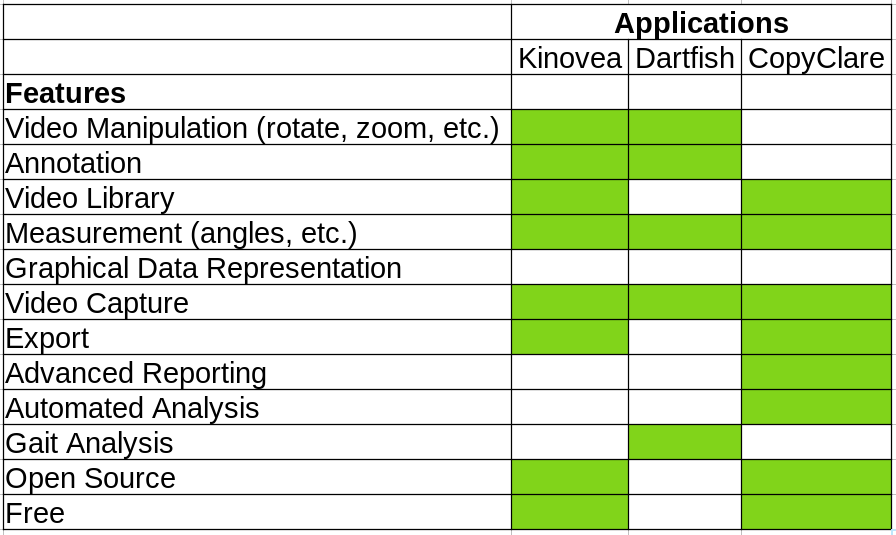

Research
========

Understanding Physiotheraphy
----------------------------

Our team has begun research very early in the process. From our conversations with the
with our client and the NeuroPhysiotherapy team, we learned that there are various
types of `physiotherapy<https://mjphysio.ca/types-of-physiotherapy/
>`_. For our project we will be working on a tool to aid:
   #. Musculoskeletal physiotherapy (client requirement)
   #. Neurological physiotheraphy (NeuroPhysiotherapy team requirement)

Although both types of therapy have different exercises, the characteristics of their exercises are
the same. The exercise tend to be slow, repetitive, and rely mostly on body weight.

We have also learned that the feedback physiotherapists give patients is based on:
    #. Trajectory
    #. Accuracy
    #. Coordination
    #. Precision
    #. Time
    #. Speed
    #. Effciency
    #. Effort
    #. Repetition
    #. Jerk
    #. Distance

In addition, physiotherapists also use `Gait analysis <https://www.mgs.physio/what-is-gait-analysis/
>`_ to identify weaknesses and demonstrate
progress over time. Althought this is out of the scope of our project, we thought that the
`Wee Gait Glasgow Index<https://www.quest.scot.nhs.uk/hc/en-gb/articles/360000547917-The-Wee-Glasgow-Gait-Index
>`_ and `Edinburgh Visual Gait Score <https://pubmed.ncbi.nlm.nih.gov/12724590/>`_ are
very interesting ways of calcualting Gait scores.

Similar Tools
-------------

Upon further research, we've learned that there are two tools similar to CopyClare:
`Kinovea <https://www.kinovea.org/>`_ and `Dartfish <https://www.dartfish.com/healthcare>`_.

Based on the features of Kinovea and Dartfish, we were able to realise how important CopyClare is

Here is how CopyClare compares with them:

While the other two tools mainly focus on sports analysis, CopyClare is the first patient
facing tool with automated exercise analysis (our accuracy calcuations) without the active
need for a physiotherapist.

Additional Resources:
https://www.youtube.com/watch?v=MV_sZNAiVts&t=145s
https://bess.ac.uk/exercises-for-shoulder-pain/
