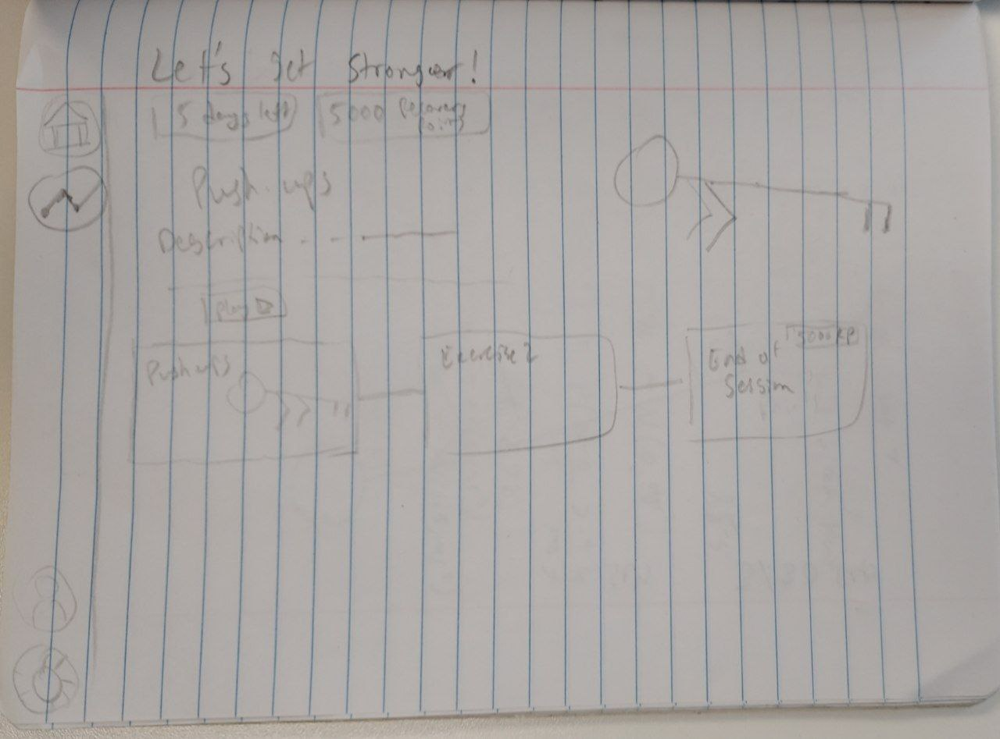
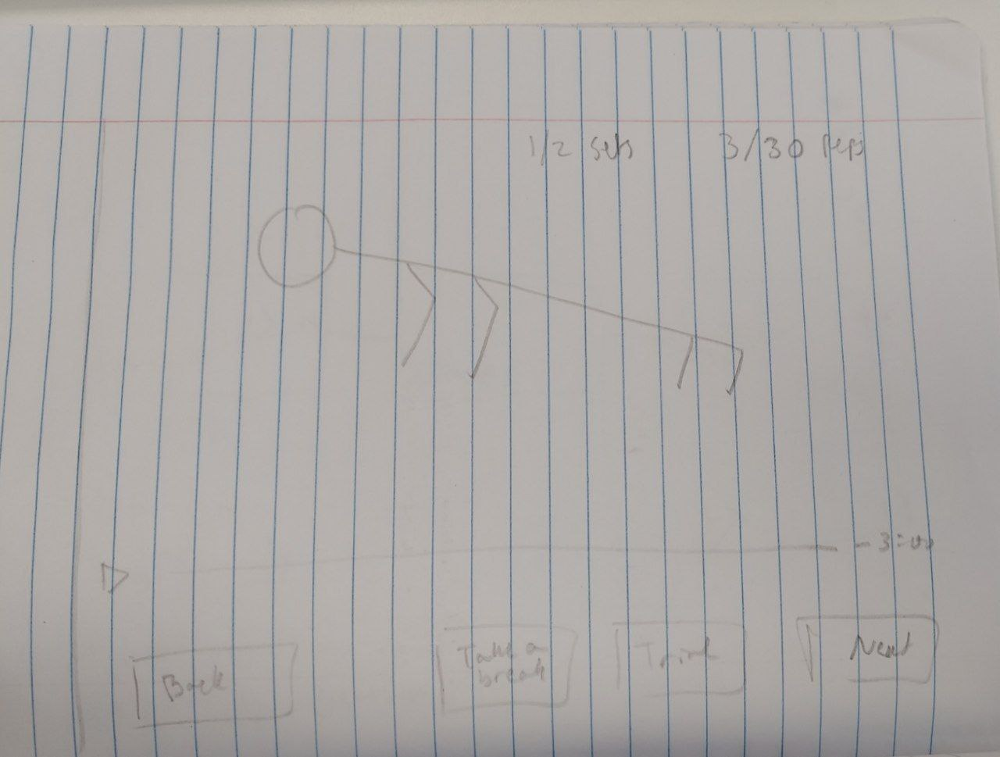
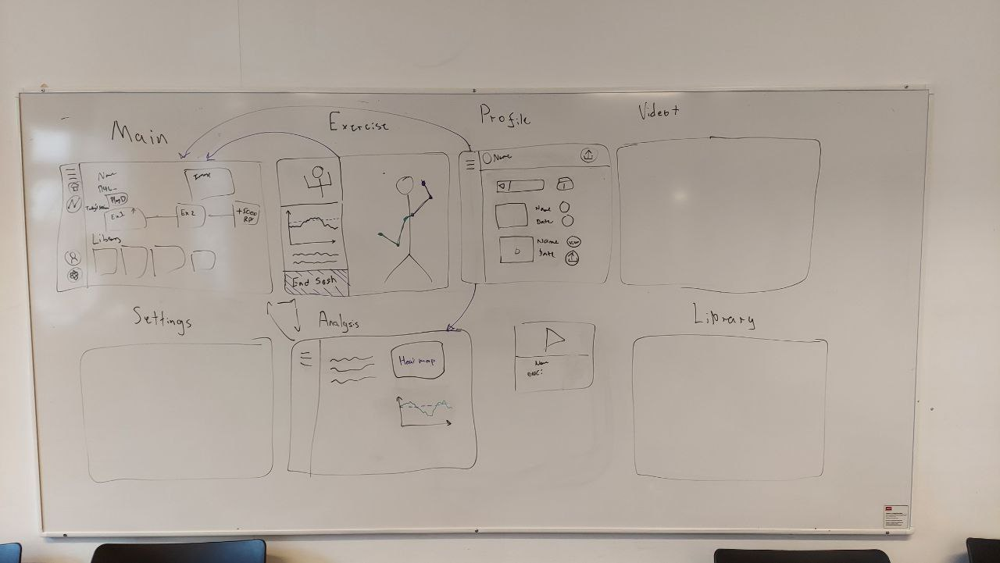

UI Design
=========

Design Requirements
-------------------

Based on our MosCow list, we need to needed to build a user-centric design. We simply began with the UX/UI requirements.

#. Need the following pages to statisfy our MosCow requirements:
    * Home page
    * Exercises page
    * Analysis page
    * Profile page
    * Settings page (optional)
    * Video trimmer page (optional)
#. Big buttons for the UI to increase usabilty.
#. Simplified user experience for the user as they may not have the capacity/patience to thoroughly understand the application

Throughout our development of the UI, we regularly met with our clients and a team of NeuroPhysiotherapy Masters students and their supervisor to enhance our designs.

The 3 main Usabilty Principles we focused on were:

#. Learnabilty
#. Memorability
#. Utility

You will see how we have incorporated our understanding of HCI to our work on CopyClare's UX & UI.

UI Sketches
-----------

Here are our initial sketches for CopyClare:

The designs were inspired by Netflix and how users can find the right exercise and begin their physiotherapy. However, we realized that it is very difficult to implement using PyQT5. Therefore we need to draft another version of the app.

UI Mockup
---------

2nd Iteration
-------------

